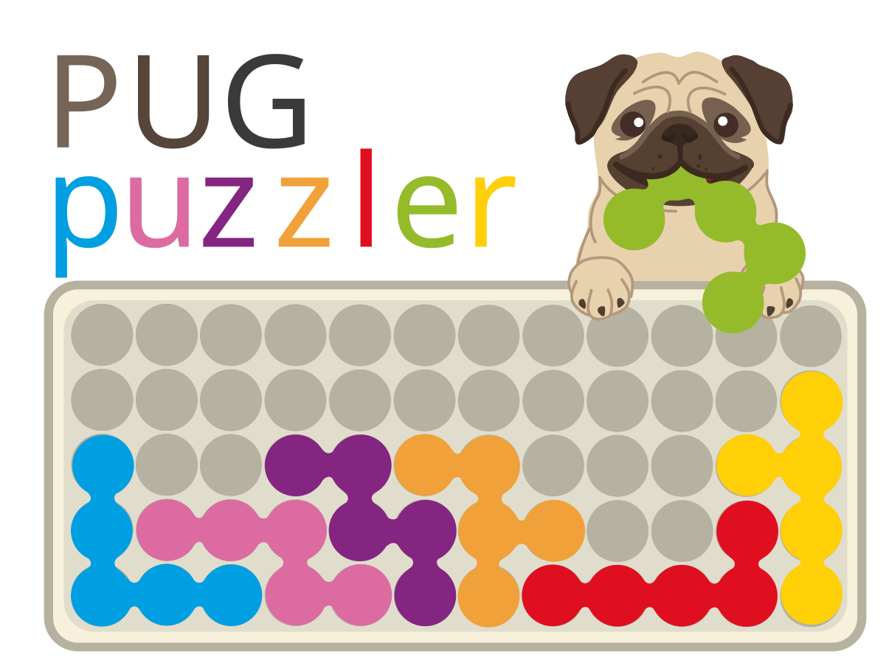

<p align="center">
  
</p>

# PUGpuzzler

**PUGpuzzler** (*Pretty Universal Geometry*) is a solver for polyform-based packing puzzles: given a board and a set of pieces, it finds **every** way to fill the board. It frames the puzzle as an exact cover problem, using Knuth's Algorithm X with bitmasks instead of dancing links, compiled with numba.

It started as a project to investigate the difficulty of such games, but grew into a more general tool along the way. PUGpuzzler supports:

- 2-dimensional and 3 dimensional puzzles
- puzzles on rectangular and triangular lattices
- easy loading and saving of new puzzles
- tools for investigating the puzzles and their solutions 


## Why

As a kid I would often spend hours at a time trying to solve the puzzles from the **IQpuzzler* from SmartGames. I don't think I ever even finished a single puzzle from the hardest difficulty, *wizard*.

A few years ago I tried to write a solver for it in Python with the limited knowledge I had then. It worked, but it was too slow to answer my questions, so I abandoned it. Recently I picked it up again and rewrote it from scratch, this time generalizing it to 3D puzzles and other variants.

## What it found

The tutorials run the solver on the puzzle booklets of **IQpuzzler** (the original) and **IQpuzzlerPRO** (the sequel). A few of the results:

- While the pyramid puzzles are harder to the human player than the 2-dimensional puzzles, the computer actually finds them easier.
- While some of the IQpuzzler's 72 booklet puzzles have a unique solution, others have many more (some more than a thousand). 
- Although the IQPuzzlerPRO promises a unique solution to every puzzle, we see that this holds for all but one puzzle.
- We investigate how difficult of a puzzle we can make for both games, and find new puzzles that are objectively harder than any of the given puzzles in their booklets.


## Tutorials


The best way to see how it all works is to run the two notebooks in [tutorial/](tutorial/). Everything in them is computed when you run it.

1. [1_solver.ipynb](tutorial/1_solver.ipynb): the algorithm. How a game is represented, how packing becomes exact cover, and how the search works, with a puzzle small enough to follow node by node. Game-agnostic.
2. [2_findings.ipynb](tutorial/2_findings.ipynb): the applications. Solving the booklets, the bounds, the fewest pieces that make a unique puzzle, and checking IQpuzzlerPRO's promise.

For the code itself, [SOLVER_WALKTHROUGH.md](SOLVER_WALKTHROUGH.md) goes through the solver, and [SOLVER_NOTES.md](SOLVER_NOTES.md) has the measurements behind each design choice, including the ideas I tried and removed.

## Quick start

```
pip install -r requirements.txt
python run_tests.py
```

Solve a booklet puzzle and print its solutions:

```python
from constants import GAMES_DIR
from serialization import load_game
from solving import solve_puzzle, Verbosity

game = load_game(GAMES_DIR / "IQpuzzler")
solutions, stats = solve_puzzle(game.books["main_puzzles"]["50"], verbose=Verbosity.SHOW_SOLUTIONS)
```

A game lives in `games/<Game>/`: `blocks.json`, `boards.json`, and optional `books/` and `puzzles/` folders. `CLAUDE.md` has a full map of the codebase.

## On agentic coding, and the name

With the help of agentic coding, this task turned out to be far less daunting than it looked. As the project went on, I leaned more and more on LLMs for advice on architecture, cleaning up code and running tests. But unlike with my first attempt years ago, I could feel that I didn't have a full grasp of what the code was doing. I understood the individual parts, but the full picture was slipping away from me. Near the end of the project, I came across this video from 3Blue1Brown creator Grant Sanderson:

https://youtu.be/0Ge3jKLDJaA

It resonated with me. Before this project, I felt I had a deeper understanding of the code I produced, and now I found myself placing more trust in these agentic models. I was starting to identify more with the pug than the border collie. Hence the name: PUGpuzzler.

To be clear, I still claim responsibility for this project and what it does. I have a good understanding of the code, although maybe not as deep as I could. But that was never the goal: I started this out of curiosity and passion, to answer some questions about a game I hold dear, and I think PUGpuzzler succeeded at that.

This is a personal project, not a polished tool, and it isn't unique either. Many similar solvers exist, probably more efficient and more general (see polyformpuzzler, cemulate's polyomino-solver, and others).
